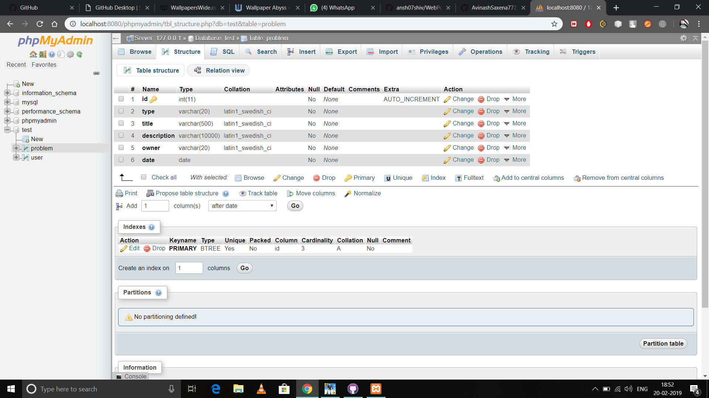
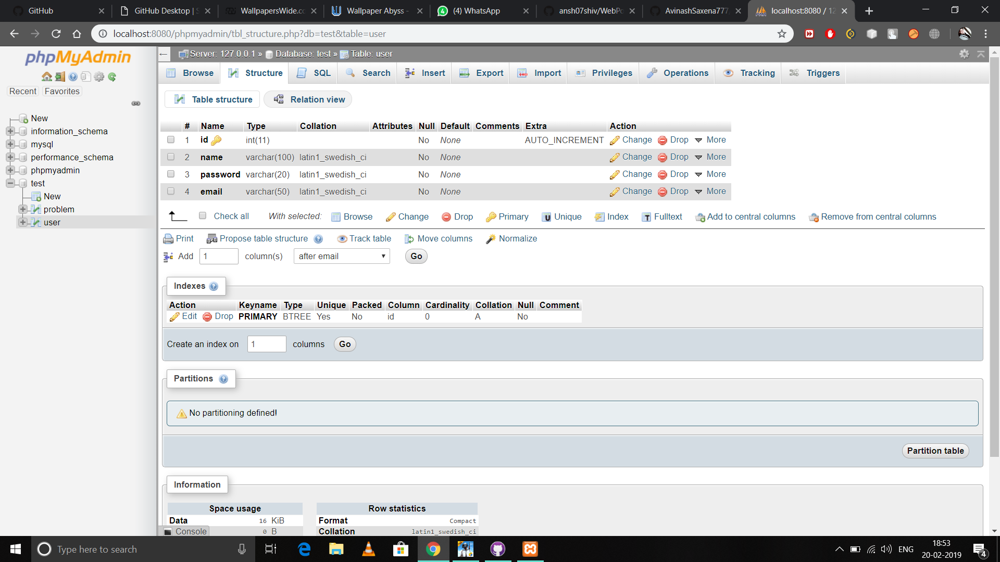

# SupportPortal

index.php - Homepage with login and registration

Financial.php - Lists all the problems (with template)

profile.php - Profile Page (Simple page without interface and template)

addprblm.php - Add Problem page (Simple page without interface and template)

Problem Table

User Table

